# EcoMonitor - Plataforma Inteligente de Gestão Energética Sustentável

## 📋 Índice
1. [Resumo Executivo](#resumo-executivo)
2. [Justificativa para MongoDB](#justificativa-para-mongodb)
3. [Pilares ESG](#pilares-esg)
4. [Arquitetura do Banco de Dados](#arquitetura-do-banco-de-dados)
5. [Operações CRUD](#operações-crud)
6. [Consultas Avançadas](#consultas-avançadas)
7. [Operações de Atualização](#operações-de-atualização)
8. [Operações de Exclusão](#operações-de-exclusão)

---

## Resumo Executivo

**EcoMonitor** é uma plataforma inteligente de gestão energética sustentável desenvolvida para monitoramento em tempo real do consumo energético corporativo. O sistema integra dados de sensores IoT distribuídos, gerando alertas automáticos de consumo excessivo, promovendo ações de sustentabilidade e garantindo compliance com normas ambientais internacionais.

### Objetivo Principal
Reduzir o consumo energético através de monitoramento contínuo, identificando padrões de desperdício e habilitando tomadas de decisão baseadas em dados para promover eficiência energética e sustentabilidade corporativa.

---

## Justificativa para MongoDB

A escolha do MongoDB como banco de dados NoSQL foi fundamentada em quatro pilares técnicos:

### 1. 🔄 Alta Disponibilidade
- Sensores IoT operam **24/7** gerando dados continuamente
- Replicação automática garante **zero downtime**
- Essencial para monitoramento em tempo real sem interrupções

### 2. 📈 Escalabilidade Horizontal
- Suporta crescimento de **10 para 10.000 sensores** sem reengenharia
- Sharding automático distribui carga entre servidores
- Crescimento elástico conforme expansão da empresa

### 3. 🔌 Flexibilidade de Esquema
- Diferentes tipos de sensores (energia, temperatura, luminosidade, etc.) com atributos específicos
- Evolução do sistema sem migrations complexas e disruptivas
- Dados de IoT são naturalmente heterogêneos - perfeito para NoSQL

### 4. ⚡ Performance em Escrita
- Alta taxa de inserções (milhares de leituras por minuto)
- Indexação eficiente para consultas em tempo real
- Agregações complexas para dashboards gerenciais

---

## Pilares ESG

A plataforma EcoMonitor está estruturada para atender aos três pilares de sustentabilidade corporativa (ESG):

### 🌍 **Environmental (Ambiental)**
- Redução do consumo energético através de monitoramento contínuo
- Identificação automática de desperdícios e vazamentos de energia
- Promoção de energia limpa e eficiência operacional
- Rastreamento de emissões de carbono

### 👥 **Social (Social)**
- Conscientização dos colaboradores sobre sustentabilidade corporativa
- Gamificação de programas de economia energética
- Promoção de cultura organizacional verde
- Envolvimento dos stakeholders em metas ambientais

### ⚖️ **Governance (Governança)**
- Compliance com normas ISO 50001 e ISO 14001
- Auditorias automatizadas e rastreabilidade completa
- Relatórios regulatórios para stakeholders e órgãos fiscalizadores
- Documentação e evidências de conformidade

---

## Arquitetura do Banco de Dados

### Criação do Banco de Dados

```bash
use ecomonitor_db
```

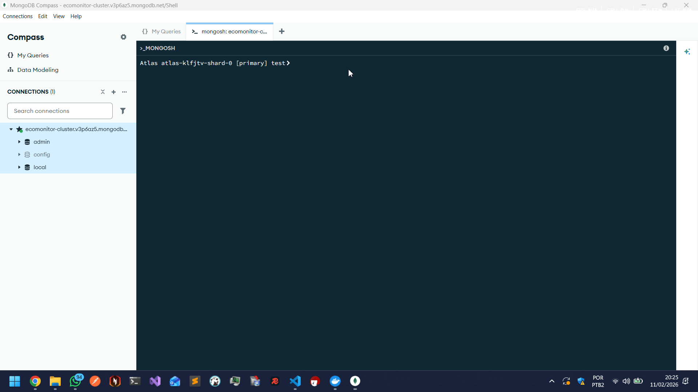

### Criação das Collections

```bash
db.createCollection("sensors")
db.createCollection("energy_readings")
db.createCollection("alerts")
db.createCollection("sustainability_actions")
db.createCollection("compliance_reports")
```

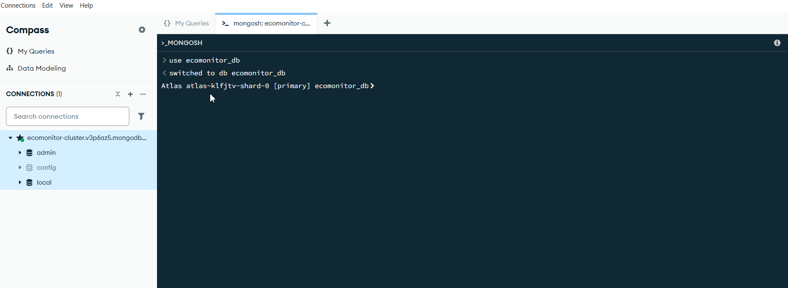

### Validação da Estrutura

```bash
show collections
# Ou alternadamente
db.getCollectionNames()
```


---

### 📊 As 5 Collections do Projeto

#### **Collection 1: sensors**
| Aspecto | Descrição |
|---------|-----------|
| **Pilar ESG** | Ambiental |
| **Propósito** | Armazena o cadastro de todos os dispositivos IoT instalados para monitoramento |
| **Flexibilidade** | Diferentes tipos de sensores (energia, temperatura, luminosidade) possuem especificações técnicas distintas no campo `specs` |
| **Escalabilidade** | Suporta crescimento sem reengenharia do esquema |

#### **Collection 2: energy_readings**
| Aspecto | Descrição |
|---------|-----------|
| **Pilar ESG** | Ambiental |
| **Propósito** | Registra as leituras de consumo energético em tempo real |
| **Flexibilidade** | Leituras podem ter metadados variados (anomalias, condições climáticas, horário de pico) |
| **Modelagem** | Série temporal de dados com índices otimizados |

#### **Collection 3: alerts**
| Aspecto | Descrição |
|---------|-----------|
| **Pilares ESG** | Ambiental + Governança |
| **Propósito** | Gerencia alertas de consumo excessivo e anomalias detectadas |
| **Flexibilidade** | Diferentes tipos de alerta possuem campos específicos (threshold, actions_taken) |
| **Workflows** | Suporta rastreamento de status e resolução de incidentes |

#### **Collection 4: sustainability_actions**
| Aspecto | Descrição |
|---------|-----------|
| **Pilares ESG** | Ambiental + Social |
| **Propósito** | Registra ações de sustentabilidade executadas e suas métricas |
| **Flexibilidade** | Ações podem ser automáticas, campanhas, investimentos ou treinamentos, cada uma com métricas próprias |
| **ROI** | Calcula retorno sobre investimento e payback |

#### **Collection 5: compliance_reports**
| Aspecto | Descrição |
|---------|-----------|
| **Pilar ESG** | Governança |
| **Propósito** | Consolida relatórios de conformidade e auditorias regulatórias |
| **Flexibilidade** | Relatórios de diferentes normas (ISO 50001, ISO 14001, emissões de carbono) possuem estruturas variadas |
| **Rastreabilidade** | Mantém histórico completo de auditorias e conformidade |

---

## Operações CRUD

### CREATE - Inserção de Dados

#### 📌 1.1.0 - Inserindo Sensores com `insertOne`

A operação `insertOne` insere um único documento na collection. Exemplos de todos os tipos de sensores:

```bash
# Sensor 1 - Medidor de Energia Principal
db.sensors.insertOne({
  sensor_id: "ENERGY_001",
  type: "energy_meter",
  location: {
    building: "Sede São Paulo",
    floor: 3,
    department: "TI",
    zone: "Datacenter"
  },
  status: "active",
  installation_date: ISODate("2026-01-15"),
  specs: {
    max_power_kw: 100,
    voltage_range: [110, 220],
    protocol: "Modbus TCP",
    manufacturer: "Schneider Electric"
  }
})

# Sensor 2 - Medidor de Energia Escritório
db.sensors.insertOne({
  sensor_id: "ENERGY_002",
  type: "energy_meter",
  location: {
    building: "Sede São Paulo",
    floor: 2,
    department: "Administrativo",
    zone: "Open Space"
  },
  status: "active",
  installation_date: ISODate("2026-01-20"),
  specs: {
    max_power_kw: 50,
    voltage_range: [110, 220],
    protocol: "Modbus RTU",
    manufacturer: "ABB"
  }
})

# Sensor 3 - Sensor de Temperatura Datacenter
db.sensors.insertOne({
  sensor_id: "TEMP_001",
  type: "temperature",
  location: {
    building: "Sede São Paulo",
    floor: 3,
    department: "TI",
    zone: "Datacenter"
  },
  status: "active",
  installation_date: ISODate("2026-02-01"),
  specs: {
    range_celsius: [-10, 50],
    accuracy: 0.5,
    unit: "celsius",
    manufacturer: "Honeywell"
  },
  calibration_date: ISODate("2026-02-01"),
  next_calibration: ISODate("2025-02-01")
})

# Sensor 4 - Sensor de Luminosidade
db.sensors.insertOne({
  sensor_id: "LIGHT_001",
  type: "light_sensor",
  location: {
    building: "Sede São Paulo",
    floor: 2,
    department: "Administrativo",
    zone: "Sala de Reuniões A"
  },
  status: "active",
  installation_date: ISODate("2026-02-10"),
  specs: {
    range_lux: [0, 10000],
    response_time_ms: 100,
    manufacturer: "Philips"
  }
})

# Sensor 5 - Medidor de Energia Filial RJ
db.sensors.insertOne({
  sensor_id: "ENERGY_003",
  type: "energy_meter",
  location: {
    building: "Filial Rio de Janeiro",
    floor: 1,
    department: "Produção",
    zone: "Linha de Montagem 1"
  },
  status: "active",
  installation_date: ISODate("2026-03-01"),
  specs: {
    max_power_kw: 200,
    voltage_range: [220, 380],
    protocol: "Modbus TCP",
    manufacturer: "Siemens",
    three_phase: true
  }
})

# Sensor 6 - Sensor de Temperatura Produção
db.sensors.insertOne({
  sensor_id: "TEMP_002",
  type: "temperature",
  location: {
    building: "Filial Rio de Janeiro",
    floor: 1,
    department: "Produção",
    zone: "Linha de Montagem 1"
  },
  status: "active",
  installation_date: ISODate("2026-03-05"),
  specs: {
    range_celsius: [0, 80],
    accuracy: 1.0,
    unit: "celsius",
    manufacturer: "Omega"
  },
  calibration_date: ISODate("2026-03-05")
})

# Sensor 7 - Medidor de Energia em Manutenção
db.sensors.insertOne({
  sensor_id: "ENERGY_004",
  type: "energy_meter",
  location: {
    building: "Sede São Paulo",
    floor: 1,
    department: "Facilities",
    zone: "Ar Condicionado Central"
  },
  status: "maintenance",
  installation_date: ISODate("2026-01-10"),
  specs: {
    max_power_kw: 150,
    voltage_range: [220, 380],
    protocol: "BACnet",
    manufacturer: "Johnson Controls"
  },
  maintenance_reason: "Calibração preventiva",
  maintenance_start: ISODate("2026-11-18")
})

# Sensor 8 - Sensor de Umidade
db.sensors.insertOne({
  sensor_id: "HUMID_001",
  type: "humidity",
  location: {
    building: "Sede São Paulo",
    floor: 3,
    department: "TI",
    zone: "Datacenter"
  },
  status: "active",
  installation_date: ISODate("2026-02-15"),
  specs: {
    range_percentage: [0, 100],
    accuracy: 2.0,
    manufacturer: "Vaisala"
  }
})

# Sensor 9 - Medidor de Energia Estacionamento
db.sensors.insertOne({
  sensor_id: "ENERGY_005",
  type: "energy_meter",
  location: {
    building: "Sede São Paulo",
    floor: -1,
    department: "Facilities",
    zone: "Estacionamento - Iluminação"
  },
  status: "active",
  installation_date: ISODate("2026-04-01"),
  specs: {
    max_power_kw: 30,
    voltage_range: [110, 220],
    protocol: "MQTT",
    manufacturer: "Shelly",
    smart_control: true
  }
})

# Sensor 10 - Sensor de Presença
db.sensors.insertOne({
  sensor_id: "MOTION_001",
  type: "motion_detector",
  location: {
    building: "Sede São Paulo",
    floor: 2,
    department: "Administrativo",
    zone: "Corredor Principal"
  },
  status: "active",
  installation_date: ISODate("2026-04-10"),
  specs: {
    detection_range_meters: 10,
    field_of_view_degrees: 120,
    manufacturer: "Bosch"
  }
})

# Sensor 11 - Medidor Solar
db.sensors.insertOne({
  sensor_id: "SOLAR_001",
  type: "solar_panel_monitor",
  location: {
    building: "Sede São Paulo",
    floor: 5,
    department: "Facilities",
    zone: "Telhado - Painéis Solares"
  },
  status: "active",
  installation_date: ISODate("2026-05-01"),
  specs: {
    panel_capacity_kw: 50,
    efficiency_percentage: 22,
    manufacturer: "Canadian Solar",
    inverter_model: "SMA Sunny Tripower"
  },
  renewable_energy: true
})

# Sensor 12 - Sensor Inativo
db.sensors.insertOne({
  sensor_id: "ENERGY_006",
  type: "energy_meter",
  location: {
    building: "Filial Rio de Janeiro",
    floor: 2,
    department: "Comercial",
    zone: "Sala de Vendas"
  },
  status: "inactive",
  installation_date: ISODate("2023-12-01"),
  specs: {
    max_power_kw: 40,
    voltage_range: [110, 220],
    protocol: "Modbus TCP",
    manufacturer: "ABB"
  },
  deactivation_date: ISODate("2026-10-15"),
  deactivation_reason: "Área desativada temporariamente"
})
```

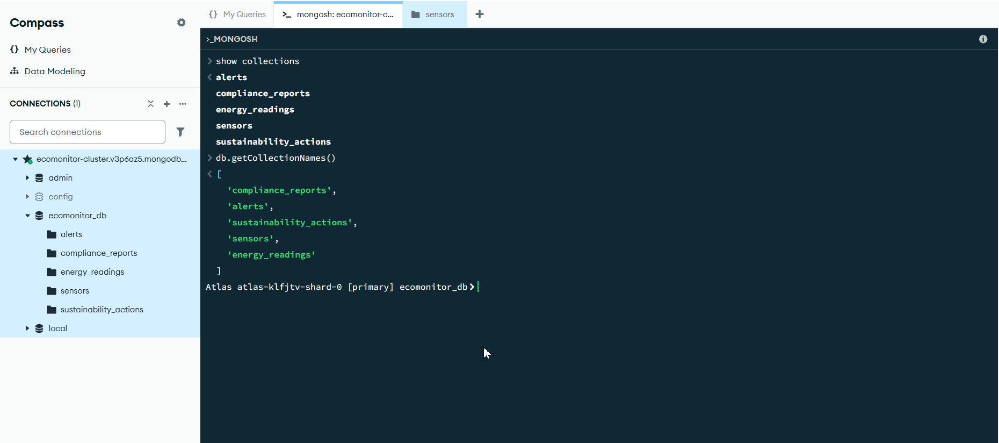

#### 📌 1.1.1 - Inserindo Sensores com `insertMany`

A operação `insertMany` permite inserir múltiplos documentos em uma única operação, melhorando a performance:

```bash
db.sensors.insertMany([
  {
    sensor_id: "ENERGY_001",
    type: "energy_meter",
    location: { building: "Sede São Paulo", floor: 3, department: "TI", zone: "Datacenter" },
    status: "active",
    installation_date: ISODate("2026-01-15"),
    specs: { max_power_kw: 100, voltage_range: [110, 220], protocol: "Modbus TCP", manufacturer: "Schneider Electric" }
  },
  {
    sensor_id: "ENERGY_002",
    type: "energy_meter",
    location: { building: "Sede São Paulo", floor: 2, department: "Administrativo", zone: "Open Space" },
    status: "active",
    installation_date: ISODate("2026-01-20"),
    specs: { max_power_kw: 50, voltage_range: [110, 220], protocol: "Modbus RTU", manufacturer: "ABB" }
  },
  {
    sensor_id: "TEMP_001",
    type: "temperature",
    location: { building: "Sede São Paulo", floor: 3, department: "TI", zone: "Datacenter" },
    status: "active",
    installation_date: ISODate("2026-02-01"),
    specs: { range_celsius: [-10, 50], accuracy: 0.5, unit: "celsius", manufacturer: "Honeywell" },
    calibration_date: ISODate("2026-02-01"),
    next_calibration: ISODate("2025-02-01")
  },
  {
    sensor_id: "LIGHT_001",
    type: "light_sensor",
    location: { building: "Sede São Paulo", floor: 2, department: "Administrativo", zone: "Sala de Reuniões A" },
    status: "active",
    installation_date: ISODate("2026-02-10"),
    specs: { range_lux: [0, 10000], response_time_ms: 100, manufacturer: "Philips" }
  },
  {
    sensor_id: "ENERGY_003",
    type: "energy_meter",
    location: { building: "Filial Rio de Janeiro", floor: 1, department: "Produção", zone: "Linha de Montagem 1" },
    status: "active",
    installation_date: ISODate("2026-03-01"),
    specs: { max_power_kw: 200, voltage_range: [220, 380], protocol: "Modbus TCP", manufacturer: "Siemens", three_phase: true }
  },
  {
    sensor_id: "TEMP_002",
    type: "temperature",
    location: { building: "Filial Rio de Janeiro", floor: 1, department: "Produção", zone: "Linha de Montagem 1" },
    status: "active",
    installation_date: ISODate("2026-03-05"),
    specs: { range_celsius: [0, 80], accuracy: 1.0, unit: "celsius", manufacturer: "Omega" },
    calibration_date: ISODate("2026-03-05")
  },
  {
    sensor_id: "ENERGY_004",
    type: "energy_meter",
    location: { building: "Sede São Paulo", floor: 1, department: "Facilities", zone: "Ar Condicionado Central" },
    status: "maintenance",
    installation_date: ISODate("2026-01-10"),
    specs: { max_power_kw: 150, voltage_range: [220, 380], protocol: "BACnet", manufacturer: "Johnson Controls" },
    maintenance_reason: "Calibração preventiva",
    maintenance_start: ISODate("2026-11-18")
  },
  {
    sensor_id: "HUMID_001",
    type: "humidity",
    location: { building: "Sede São Paulo", floor: 3, department: "TI", zone: "Datacenter" },
    status: "active",
    installation_date: ISODate("2026-02-15"),
    specs: { range_percentage: [0, 100], accuracy: 2.0, manufacturer: "Vaisala" }
  },
  {
    sensor_id: "ENERGY_005",
    type: "energy_meter",
    location: { building: "Sede São Paulo", floor: -1, department: "Facilities", zone: "Estacionamento - Iluminação" },
    status: "active",
    installation_date: ISODate("2026-04-01"),
    specs: { max_power_kw: 30, voltage_range: [110, 220], protocol: "MQTT", manufacturer: "Shelly", smart_control: true }
  },
  {
    sensor_id: "MOTION_001",
    type: "motion_detector",
    location: { building: "Sede São Paulo", floor: 2, department: "Administrativo", zone: "Corredor Principal" },
    status: "active",
    installation_date: ISODate("2026-04-10"),
    specs: { detection_range_meters: 10, field_of_view_degrees: 120, manufacturer: "Bosch" }
  },
  {
    sensor_id: "SOLAR_001",
    type: "solar_panel_monitor",
    location: { building: "Sede São Paulo", floor: 5, department: "Facilities", zone: "Telhado - Painéis Solares" },
    status: "active",
    installation_date: ISODate("2026-05-01"),
    specs: { panel_capacity_kw: 50, efficiency_percentage: 22, manufacturer: "Canadian Solar", inverter_model: "SMA Sunny Tripower" },
    renewable_energy: true
  },
  {
    sensor_id: "ENERGY_006",
    type: "energy_meter",
    location: { building: "Filial Rio de Janeiro", floor: 2, department: "Comercial", zone: "Sala de Vendas" },
    status: "inactive",
    installation_date: ISODate("2023-12-01"),
    specs: { max_power_kw: 40, voltage_range: [110, 220], protocol: "Modbus TCP", manufacturer: "ABB" },
    deactivation_date: ISODate("2026-10-15"),
    deactivation_reason: "Área desativada temporariamente"
  }
])
```


#### 📌 1.1.2 - Verificação de Dados Inseridos

```bash
db.sensors.find()
```

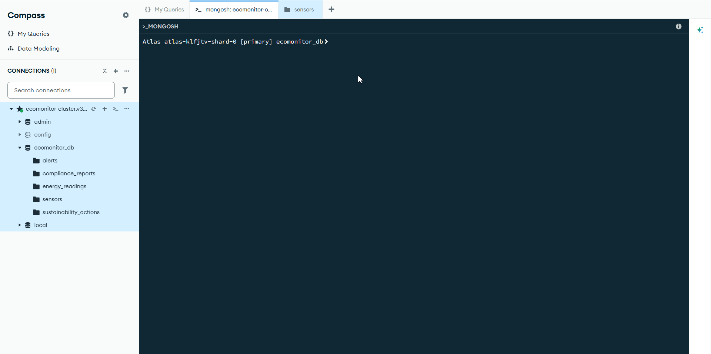

#### 📌 1.1.3 - Inserindo Leituras de Energia

```bash
db.energy_readings.insertMany([
  {
    sensor_id: "ENERGY_001",
    timestamp: ISODate("2026-11-20T08:00:00Z"),
    consumption_kwh: 45.7,
    voltage_v: 220,
    current_a: 15.2,
    power_factor: 0.95,
    cost_brl: 38.52
  },
  {
    sensor_id: "ENERGY_002",
    timestamp: ISODate("2026-11-20T08:00:00Z"),
    consumption_kwh: 22.3,
    voltage_v: 218,
    current_a: 7.8,
    power_factor: 0.92,
    cost_brl: 18.79
  },
  {
    sensor_id: "ENERGY_001",
    timestamp: ISODate("2026-11-20T14:30:00Z"),
    consumption_kwh: 78.5,
    voltage_v: 221,
    current_a: 26.1,
    power_factor: 0.94,
    cost_brl: 66.17,
    peak_hour: true,
    notes: "Processamento de backup completo"
  },
  {
    sensor_id: "ENERGY_002",
    timestamp: ISODate("2026-11-20T15:45:00Z"),
    consumption_kwh: 152.3,
    voltage_v: 218,
    current_a: 48.5,
    power_factor: 0.87,
    cost_brl: 128.44,
    anomaly_detected: true,
    anomaly_type: "spike",
    metadata: { weather_condition: "heat_wave", external_temperature_celsius: 38, ac_systems_running: 12 }
  },
  {
    sensor_id: "ENERGY_003",
    timestamp: ISODate("2026-11-20T09:00:00Z"),
    consumption_kwh: 145.8,
    voltage_v: 380,
    current_a: 28.3,
    power_factor: 0.96,
    cost_brl: 122.89,
    production_shift: "morning",
    machines_active: 8
  },
  {
    sensor_id: "ENERGY_003",
    timestamp: ISODate("2026-11-20T14:00:00Z"),
    consumption_kwh: 167.2,
    voltage_v: 378,
    current_a: 32.5,
    power_factor: 0.97,
    cost_brl: 140.87,
    production_shift: "afternoon",
    machines_active: 10
  },
  {
    sensor_id: "ENERGY_001",
    timestamp: ISODate("2026-11-20T22:00:00Z"),
    consumption_kwh: 18.2,
    voltage_v: 220,
    current_a: 6.1,
    power_factor: 0.93,
    cost_brl: 15.35,
    off_peak: true
  },
  {
    sensor_id: "ENERGY_004",
    timestamp: ISODate("2026-11-15T13:00:00Z"),
    consumption_kwh: 98.5,
    voltage_v: 380,
    current_a: 19.1,
    power_factor: 0.91,
    cost_brl: 83.02,
    equipment_type: "HVAC",
    outdoor_temp_celsius: 32
  },
  {
    sensor_id: "ENERGY_005",
    timestamp: ISODate("2026-11-20T19:00:00Z"),
    consumption_kwh: 12.4,
    voltage_v: 220,
    current_a: 4.1,
    power_factor: 0.88,
    cost_brl: 10.46,
    lighting_mode: "automatic",
    occupancy_detected: true
  },
  {
    sensor_id: "SOLAR_001",
    timestamp: ISODate("2026-11-20T12:00:00Z"),
    generation_kwh: 38.7,
    voltage_v: 220,
    current_a: -12.9,
    power_factor: 0.99,
    savings_brl: 32.61,
    solar_irradiance: 850,
    panel_temperature_celsius: 45,
    renewable: true
  },
  {
    sensor_id: "ENERGY_002",
    timestamp: ISODate("2026-11-20T16:00:00Z"),
    consumption_kwh: 28.9,
    voltage_v: 219,
    current_a: 9.7,
    power_factor: 0.93,
    cost_brl: 24.36,
    occupancy_percentage: 85
  },
  {
    sensor_id: "ENERGY_001",
    timestamp: ISODate("2026-11-23T10:00:00Z"),
    consumption_kwh: 32.1,
    voltage_v: 220,
    current_a: 10.7,
    power_factor: 0.94,
    cost_brl: 27.07,
    weekend: true,
    reduced_load: true
  },
  {
    sensor_id: "ENERGY_003",
    timestamp: ISODate("2026-11-20T21:00:00Z"),
    consumption_kwh: 124.5,
    voltage_v: 379,
    current_a: 24.2,
    power_factor: 0.95,
    cost_brl: 104.99,
    production_shift: "night",
    machines_active: 6,
    night_differential_discount: 0.15
  },
  {
    sensor_id: "ENERGY_005",
    timestamp: ISODate("2026-11-20T03:00:00Z"),
    consumption_kwh: 0.0,
    voltage_v: 220,
    current_a: 0.0,
    power_factor: 0.0,
    cost_brl: 0.0,
    lighting_mode: "off",
    auto_shutdown: true
  },
  {
    sensor_id: "SOLAR_001",
    timestamp: ISODate("2026-11-20T13:30:00Z"),
    generation_kwh: 42.3,
    voltage_v: 221,
    current_a: -14.1,
    power_factor: 0.99,
    savings_brl: 35.64,
    solar_irradiance: 920,
    panel_temperature_celsius: 48,
    renewable: true,
    peak_generation: true
  }
])
```


#### 📌 1.1.4 - Inserindo Alertas

```bash
db.alerts.insertMany([
  {
    alert_id: "ALT_001",
    sensor_id: "ENERGY_002",
    alert_type: "high_consumption",
    severity: "critical",
    threshold_kwh: 100,
    actual_kwh: 152.3,
    timestamp: ISODate("2026-11-20T15:45:00Z"),
    status: "open",
    assigned_to: "manutencao@empresa.com",
    notification_sent: true,
    actions_taken: []
  },
  {
    alert_id: "ALT_002",
    sensor_id: "TEMP_001",
    alert_type: "high_temperature",
    severity: "high",
    threshold_celsius: 28,
    actual_celsius: 31.5,
    timestamp: ISODate("2026-11-19T14:30:00Z"),
    status: "resolved",
    assigned_to: "ti@empresa.com",
    notification_sent: true,
    actions_taken: [
      { action: "Acionamento de ventiladores adicionais", timestamp: ISODate("2026-11-19T14:35:00Z") },
      { action: "Monitoramento intensificado", timestamp: ISODate("2026-11-19T14:40:00Z") }
    ],
    resolution_timestamp: ISODate("2026-11-19T15:00:00Z"),
    resolution_time_minutes: 30
  },
  {
    alert_id: "ALT_003",
    sensor_id: "ENERGY_004",
    alert_type: "sensor_offline",
    severity: "medium",
    timestamp: ISODate("2026-11-18T08:00:00Z"),
    status: "acknowledged",
    assigned_to: "ti@empresa.com",
    notification_sent: true,
    last_communication: ISODate("2026-11-18T07:45:00Z"),
    actions_taken: [
      { action: "Reset remoto do sensor", timestamp: ISODate("2026-11-18T08:10:00Z") },
      { action: "Verificação de conectividade", timestamp: ISODate("2026-11-18T08:15:00Z") },
      { action: "Escalação para suporte técnico", timestamp: ISODate("2026-11-18T08:20:00Z") }
    ]
  },
  {
    alert_id: "ALT_004",
    sensor_id: "ENERGY_003",
    alert_type: "consumption_peak",
    severity: "low",
    threshold_kwh: 150,
    actual_kwh: 167.2,
    timestamp: ISODate("2026-11-20T14:00:00Z"),
    status: "closed",
    assigned_to: null,
    notification_sent: false,
    expected_behavior: true,
    notes: "Pico esperado durante turno de produção"
  },
  {
    alert_id: "ALT_005",
    sensor_id: "ENERGY_005",
    alert_type: "energy_leak",
    severity: "high",
    baseline_kwh: 0.0,
    actual_kwh: 3.2,
    timestamp: ISODate("2026-11-21T02:30:00Z"),
    status: "open",
    assigned_to: "facilities@empresa.com",
    notification_sent: true,
    actions_taken: [],
    notes: "Consumo detectado fora do horário de operação"
  },
  {
    alert_id: "ALT_006",
    sensor_id: "SOLAR_001",
    alert_type: "low_generation",
    severity: "medium",
    expected_generation_kwh: 40,
    actual_generation_kwh: 18.5,
    timestamp: ISODate("2026-11-22T12:00:00Z"),
    status: "open",
    assigned_to: "facilities@empresa.com",
    notification_sent: true,
    weather_condition: "cloudy",
    actions_taken: []
  },
  {
    alert_id: "ALT_007",
    sensor_id: "MOTION_001",
    alert_type: "communication_failure",
    severity: "medium",
    timestamp: ISODate("2026-11-17T11:20:00Z"),
    status: "resolved",
    assigned_to: "ti@empresa.com",
    notification_sent: true,
    actions_taken: [
      { action: "Reinicialização do roteador wireless", timestamp: ISODate("2026-11-17T11:25:00Z") },
      { action: "Reestabelecimento de conexão", timestamp: ISODate("2026-11-17T11:30:00Z") },
      { action: "Teste de comunicação bem-sucedido", timestamp: ISODate("2026-11-17T11:35:00Z") },
      { action: "Monitoramento confirmado", timestamp: ISODate("2026-11-17T11:40:00Z") }
    ],
    resolution_timestamp: ISODate("2026-11-17T11:40:00Z"),
    resolution_time_minutes: 20
  },
  {
    alert_id: "ALT_008",
    sensor_id: null,
    alert_type: "savings_goal_achieved",
    severity: "info",
    goal_reduction_percentage: 10,
    actual_reduction_percentage: 12.5,
    timestamp: ISODate("2026-11-30T23:59:00Z"),
    status: "closed",
    assigned_to: "sustainability@empresa.com",
    notification_sent: true,
    celebration: true,
    month: "November 2026"
  },
  {
    alert_id: "ALT_009",
    sensor_id: "TEMP_002",
    alert_type: "calibration_required",
    severity: "low",
    last_calibration: ISODate("2026-03-05"),
    next_calibration_due: ISODate("2027-03-05"),
    days_until_due: 113,
    timestamp: ISODate("2026-11-12T00:00:00Z"),
    status: "open",
    assigned_to: "manutencao@empresa.com",
    notification_sent: true,
    actions_taken: []
  },
  {
    alert_id: "ALT_010",
    sensor_id: "HUMID_001",
    alert_type: "high_humidity",
    severity: "critical",
    threshold_percentage: 70,
    actual_percentage: 82,
    timestamp: ISODate("2026-11-16T16:00:00Z"),
    status: "resolved",
    assigned_to: "ti@empresa.com",
    notification_sent: true,
    actions_taken: [
      { action: "Acionamento de desumidificadores", timestamp: ISODate("2026-11-16T16:30:00Z") },
      { action: "Nivelo de umidade normalizado", timestamp: ISODate("2026-11-16T18:00:00Z") }
    ],
    resolution_timestamp: ISODate("2026-11-16T18:00:00Z"),
    resolution_time_minutes: 120,
    equipment_risk: "high"
  },
  {
    alert_id: "ALT_011",
    sensor_id: "ENERGY_001",
    alert_type: "unusual_pattern",
    severity: "medium",
    timestamp: ISODate("2026-11-23T03:00:00Z"),
    status: "investigating",
    assigned_to: "security@empresa.com",
    notification_sent: true,
    actions_taken: [
      { action: "Análise de padrão iniciada", timestamp: ISODate("2026-11-23T03:15:00Z") }
    ],
    pattern_deviation: "consumption_during_closed_hours",
    notes: "Verificar possível acesso não autorizado"
  },
  {
    alert_id: "ALT_012",
    sensor_id: "ENERGY_002",
    alert_type: "low_power_factor",
    severity: "medium",
    threshold_power_factor: 0.90,
    actual_power_factor: 0.87,
    timestamp: ISODate("2026-11-20T15:45:00Z"),
    status: "open",
    assigned_to: "facilities@empresa.com",
    notification_sent: true,
    actions_taken: [],
    potential_fine_brl: 450.00,
    recommendation: "Instalar banco de capacitores"
  }
])
```


#### 📌 1.1.5 - Inserindo Ações de Sustentabilidade

```bash
db.sustainability_actions.insertMany([
  {
    action_id: "ACT_001",
    action_type: "automatic_shutdown",
    trigger: "idle_detection",
    timestamp: ISODate("2026-11-20T18:00:00Z"),
    affected_sensors: ["ENERGY_005"],
    location: "Estacionamento - Iluminação",
    estimated_savings_kwh: 12.4,
    estimated_savings_brl: 10.46,
    status: "completed",
    automated: true
  },
  {
    action_id: "ACT_002",
    action_type: "awareness_campaign",
    title: "Campanha Luz Apagada - Novembro 2026",
    start_date: ISODate("2026-11-01"),
    end_date: ISODate("2026-11-30"),
    participants: 150,
    departments: ["TI", "RH", "Financeiro", "Comercial"],
    metrics: {
      baseline_consumption_kwh: 5000,
      final_consumption_kwh: 4388,
      reduction_kwh: 612,
      reduction_percentage: 12.24,
      savings_brl: 674.40
    },
    gamification: {
      points_awarded: 3000,
      challenges_completed: 12,
      top_performer: "Departamento de TI",
      prizes_distributed: true
    },
    status: "completed"
  },
  {
    action_id: "ACT_003",
    action_type: "infrastructure_upgrade",
    title: "Instalação de Sensores de Presença",
    timestamp: ISODate("2026-04-10"),
    investment_brl: 15000,
    affected_areas: ["Corredores", "Banheiros", "Salas de Reunião"],
    sensors_installed: 25,
    estimated_annual_savings_kwh: 8500,
    estimated_annual_savings_brl: 7165,
    payback_period_months: 25,
    status: "completed",
    roi_percentage: 47.77
  },
  {
    action_id: "ACT_004",
    action_type: "preventive_maintenance",
    title: "Limpeza e Calibração de Ar Condicionado",
    timestamp: ISODate("2026-11-15"),
    equipment: "HVAC - Ar Condicionado Central",
    sensor_id: "ENERGY_004",
    technician: "Empresa ClimaTech Ltda",
    cost_brl: 3500,
    metrics_before: {
      average_consumption_kwh: 105.2,
      efficiency_percentage: 75
    },
    metrics_after: {
      average_consumption_kwh: 89.7,
      efficiency_percentage: 88
    },
    improvement_percentage: 14.7,
    estimated_monthly_savings_brl: 389.73,
    status: "completed"
  },
  {
    action_id: "ACT_005",
    action_type: "renewable_energy",
    title: "Instalação de Sistema Fotovoltaico",
    timestamp: ISODate("2026-05-01"),
    investment_brl: 250000,
    installed_capacity_kw: 50,
    sensor_id: "SOLAR_001",
    annual_generation_estimated_kwh: 65000,
    annual_savings_estimated_brl: 54775,
    carbon_offset_kg_year: 32500,
    payback_period_months: 54,
    status: "active",
    renewable: true,
    certifications: ["ANEEL", "INMETRO"]
  },
  {
    action_id: "ACT_006",
    action_type: "equipment_replacement",
    title: "Substituição de Lâmpadas Fluorescentes por LED",
    timestamp: ISODate("2026-02-20"),
    investment_brl: 12000,
    units_replaced: 450,
    locations: ["Sede São Paulo - Todos os andares"],
    metrics: {
      power_before_w: 40,
      power_after_w: 9,
      reduction_percentage: 77.5,
      estimated_annual_savings_brl: 12139.20
    },
    payback_period_months: 11,
    status: "completed",
    environmental_impact: {
      mercury_eliminated_kg: 0.225,
      lifespan_increase_percentage: 400
    }
  },
  {
    action_id: "ACT_007",
    action_type: "automation",
    title: "Automação de Temperatura por Ocupação",
    timestamp: ISODate("2026-06-01"),
    investment_brl: 8000,
    affected_sensors: ["TEMP_001", "TEMP_002", "MOTION_001"],
    logic: "Ajustar temperatura baseado em presença e horário",
    estimated_annual_savings_kwh: 18000,
    estimated_annual_savings_brl: 15174,
    status: "active",
    automated: true
  },
  {
    action_id: "ACT_008",
    action_type: "waste_management",
    title: "Programa de Coleta Seletiva Corporativa",
    start_date: ISODate("2026-03-01"),
    participants: 200,
    materials_collected: [
      { type: "papel", weight_kg: 1850, recycling_percentage: 95 },
      { type: "plastico", weight_kg: 420, recycling_percentage: 80 },
      { type: "metal", weight_kg: 180, recycling_percentage: 99 },
      { type: "eletronico", weight_kg: 95, recycling_percentage: 70 }
    ],
    total_weight_kg: 2545,
    carbon_offset_kg: 3817.5,
    revenue_brl: 1272.50,
    status: "ongoing",
    partner: "EcoRecicla Brasil"
  },
  {
    action_id: "ACT_009",
    action_type: "training",
    title: "Treinamento de Boas Práticas de Sustentabilidade",
    timestamp: ISODate("2026-07-15"),
    participants: 180,
    duration_hours: 4,
    topics: [
      "Eficiência Energética",
      "Gestão de Resíduos",
      "Mobilidade Sustentável",
      "Compliance Ambiental"
    ],
    cost_brl: 5400,
    satisfaction_score: 4.7,
    certificates_issued: 180,
    status: "completed"
  },
  {
    action_id: "ACT_010",
    action_type: "carbon_offset",
    title: "Compra de Créditos de Carbono",
    timestamp: ISODate("2026-10-01"),
    investment_brl: 35000,
    vendor: "Carbon Trust International",
    credits_purchased: 1000,
    carbon_offset_kg: 1000000,
    certification: "VCS (Verified Carbon Standard)",
    status: "completed",
    monitoring_reports: 2
  },
  {
    action_id: "ACT_011",
    action_type: "partnership",
    title: "Parceria com Fornecedor Sustentável",
    timestamp: ISODate("2026-08-20"),
    partner_name: "EnergiaPura Ltda",
    energy_source_type: "renewable",
    percentage_reduction: 20,
    estimated_annual_savings_brl: 40000,
    contract_duration_months: 36,
    status: "active",
    automated: true
  }
])
```

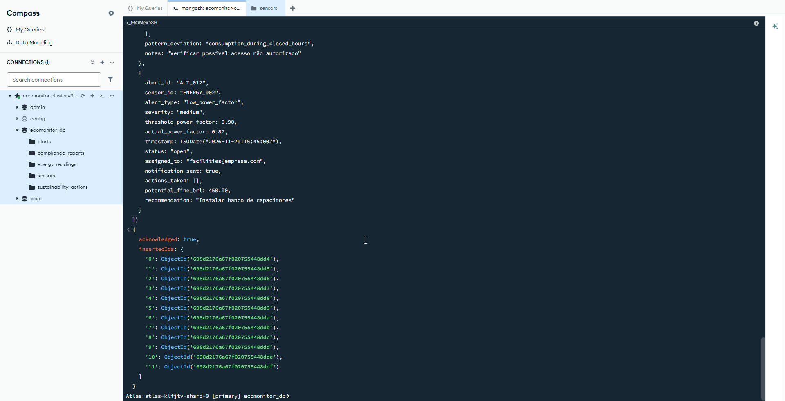

#### 📌 1.1.6 - Inserindo Relatórios de Compliance

```bash
db.compliance_reports.insertMany([
  {
    report_id: "REP_001",
    report_type: "ISO_50001",
    title: "Relatório de Conformidade ISO 50001 - 2026",
    compliance_period: "2026-01-01 até 2026-11-30",
    organization: "Empresa Sustentável LTDA",
    auditor: "Auditor Certificado - DNV GL",
    audit_date: ISODate("2026-11-25"),
    status: "compliant",
    findings: 0,
    observations: 2,
    energy_baseline_kwh: 85000,
    energy_consumption_kwh: 79200,
    improvement_percentage: 6.82,
    cost_savings_brl: 28344,
    certifications_valid: true,
    next_audit_date: ISODate("2027-11-25"),
    generated_at: ISODate("2026-11-10")
  },
  {
    report_id: "REP_002",
    report_type: "ISO_14001",
    title: "Relatório de Conformidade ISO 14001 - Gestão Ambiental",
    compliance_period: "2026-01-01 até 2026-11-30",
    organization: "Empresa Sustentável LTDA",
    auditor: "Auditor Certificado - SGS",
    audit_date: ISODate("2026-12-05"),
    status: "compliant",
    findings: 0,
    observations: 1,
    environmental_aspects_evaluated: 15,
    non_conformances: 0,
    waste_reduction_percentage: 18.5,
    emission_reduction_percentage: 12.3,
    stakeholders_engaged: true,
    certifications_valid: true,
    next_audit_date: ISODate("2027-12-05"),
    generated_at: ISODate("2026-12-05")
  },
  {
    report_id: "REP_003",
    report_type: "carbon_footprint",
    title: "Relatório de Pegada de Carbono - Novembro 2026",
    reporting_period: "2026-11-01 até 2026-11-30",
    total_emissions_kg_co2e: 18500,
    scope_1_kg_co2e: 2100,
    scope_2_kg_co2e: 14200,
    scope_3_kg_co2e: 2200,
    intensity_per_employee: 42.5,
    targets_met: true,
    reduction_vs_previous_year: 15.8,
    renewable_energy_percentage: 22,
    generated_at: ISODate("2026-12-01")
  },
  {
    report_id: "REP_004",
    report_type: "sustainability_report",
    title: "Relatório de Sustentabilidade Anual - 2026",
    reporting_period: "2026-01-01 até 2026-11-30",
    organization: "Empresa Sustentável LTDA",
    esg_scores: {
      environmental: 8.7,
      social: 8.2,
      governance: 8.5,
      overall: 8.47
    },
    material_topics: [
      "Eficiência Energética",
      "Gestão de Resíduos",
      "Engajamento de Stakeholders",
      "Ética Corporativa",
      "Direitos Humanos"
    ],
    stakeholders_surveyed: 250,
    satisfaction_score: 4.6,
    reporting_standard: "GRI Standards 2021",
    assurance_level: "moderate",
    generated_at: ISODate("2026-10-25")
  },
  {
    report_id: "REP_005",
    report_type: "monthly_energy",
    title: "Relatório Mensal de Consumo Energético - Novembro 2026",
    reporting_month: "2026-11",
    total_consumption_kwh: 52340,
    total_cost_brl: 63456.48,
    renewable_generation_kwh: 9850,
    renewable_savings_brl: 8316.75,
    peak_demand_kw: 185.4,
    average_demand_kw: 72.1,
    consumption_vs_forecast: -2.5,
    alerts_generated: 12,
    actions_completed: 8,
    savings_achieved_brl: 15233,
    recipients: ["CEO", "CFO", "Sustainability Officer"]
  },
  {
    report_id: "REP_006",
    report_type: "facilities_audit",
    title: "Auditoria de Facilities - 4º Trimestre 2026",
    audit_date: ISODate("2026-11-20"),
    facilities_inspected: 5,
    equipment_checked: 87,
    equipment_compliant: 84,
    compliance_percentage: 96.6,
    maintenance_due: 3,
    upgrades_recommended: 2,
    energy_efficiency_rating: "A++",
    certifications_status: "valid",
    next_audit_scheduled: ISODate("2027-02-20"),
    generated_at: ISODate("2026-11-30")
  },
  {
    report_id: "REP_007",
    report_type: "renewable_performance",
    title: "Relatório de Performance Solar - Novembro 2026",
    reporting_month: "2026-11",
    solar_system_capacity_kw: 50,
    expected_generation_kwh: 3500,
    actual_generation_kwh: 3420,
    performance_ratio: 97.7,
    system_efficiency: 94.2,
    peak_production_time: "12:30",
    weather_impact: "7 dias nublados",
    maintenance_performed: true,
    maintenance_type: "Limpeza de painéis",
    next_maintenance: ISODate("2027-02-20"),
    annual_co2_avoided_kg: 25650,
    generated_at: ISODate("2026-12-01")
  },
  {
    report_id: "REP_008",
    report_type: "third_party_audit",
    title: "Auditoria de Terceiros - Conformidade ESG",
    audit_firm: "Ernst & Young - Sustainability Advisory",
    audit_date: ISODate("2026-12-10"),
    audit_scope: ["Energy", "Environment", "Social", "Governance"],
    overall_rating: "A",
    recommendations_count: 8,
    critical_findings: 0,
    non_conformances: 1,
    improvement_areas: ["Board Diversity", "Supply Chain Transparency"],
    strength_areas: ["Energy Efficiency", "Waste Management"],
    certifications_recommended: ["B Corp", "ISO 50001 Advanced"],
    generated_at: ISODate("2026-12-10")
  },
  {
    report_id: "REP_009",
    report_type: "water_consumption",
    title: "Relatório de Consumo de Água - Novembro 2026",
    reporting_month: "2026-11",
    total_consumption_m3: 2450,
    consumption_per_employee: 5.6,
    comparison_with_sector: -12.3,
    rainwater_harvesting_m3: 180,
    recycled_water_m3: 120,
    water_stress_risk: "low",
    treatment_cost_brl: 7350,
    initiatives_active: 3,
    generated_at: ISODate("2026-12-15")
  },
  {
    report_id: "REP_010",
    report_type: "stakeholder_communication",
    title: "Relatório de Engajamento de Stakeholders - 2026",
    reporting_year: 2026,
    stakeholder_groups: [
      "Funcionários",
      "Clientes",
      "Fornecedores",
      "Comunidade Local",
      "Órgãos Reguladores"
    ],
    engagement_events: 24,
    total_participants: 850,
    satisfaction_score: 4.7,
    key_concerns_addressed: 12,
    commitments_made: 15,
    commitments_fulfilled: 14,
    fulfillment_percentage: 93.3,
    feedback_channels_active: 7,
    generated_at: ISODate("2026-12-20")
  }
])
```

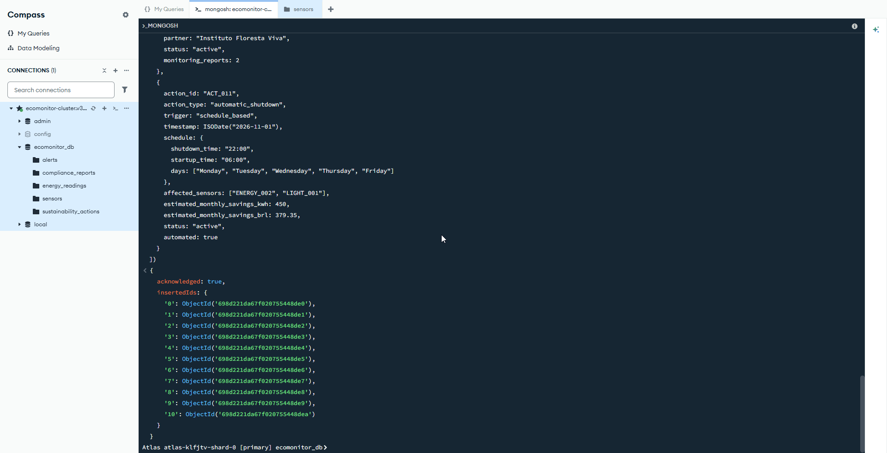

---

## Consultas Avançadas

### READ - Recuperação de Dados

#### 📌 1.2.0 - Consultas Básicas

**Consulta 1: Listar todos os sensores**
```bash
db.sensors.find()
```

**Consulta 2: Contar total de sensores**
```bash
db.sensors.countDocuments()
```

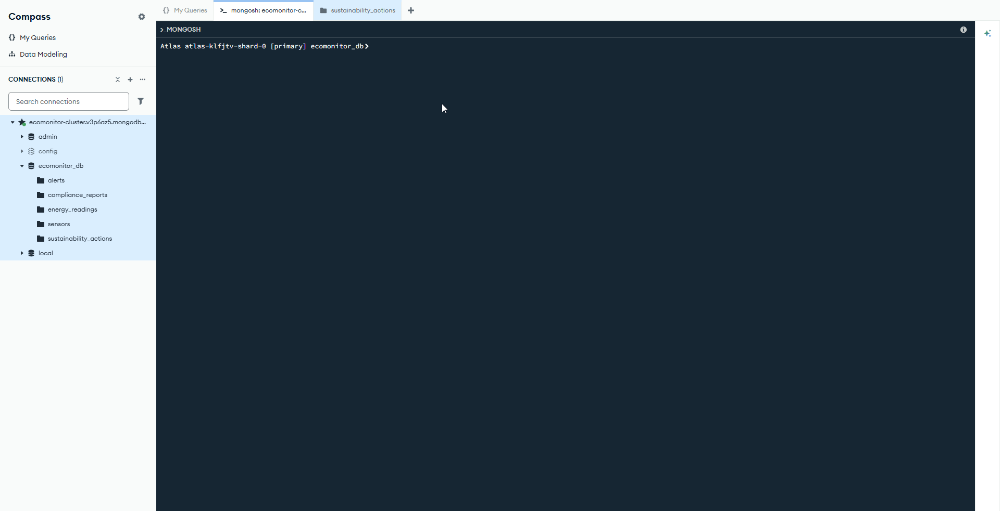

#### 📌 1.2.1 - Filtragem por Status e Tipo

**Consulta 3: Buscar sensores ATIVOS**
```bash
db.sensors.find({ status: "active" })
```

**Consulta 4: Buscar sensores de ENERGIA**
```bash
db.sensors.find({ type: "energy_meter" })
```


#### 📌 1.2.2 - Consultas por Localização

**Consulta 5: Buscar sensores na Sede São Paulo**
```bash
db.sensors.find({ "location.building": "Sede São Paulo" })
```

**Consulta 6: Buscar sensores no andar 3**
```bash
db.sensors.find({ "location.floor": 3 })
```

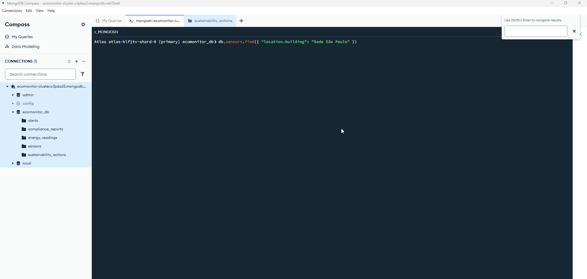

#### 📌 1.2.3 - Operadores Avançados

**Consulta 7: Buscar sensores Inativos OU em Manutenção**
```bash
db.sensors.find({ 
  status: { $in: ["inactive", "maintenance"] } 
})
```

**Consulta 8: Projetar campos específicos (sensor_id, type, building)**
```bash
db.sensors.find(
  { status: "active" },
  { sensor_id: 1, type: 1, "location.building": 1, _id: 0 }
)
```


#### 📌 1.2.4 - Agregações

**Consulta 9: Agrupar sensores por tipo e contar**
```bash
db.sensors.aggregate([
  { 
    $group: {
      _id: "$type",
      total: { $sum: 1 }
    } 
  },
  { $sort: { total: -1 } }
])
```

**Consulta 10: Buscar sensores que necessitam calibração**
```bash
db.sensors.find({ 
  calibration_date: { $exists: true } 
})
```

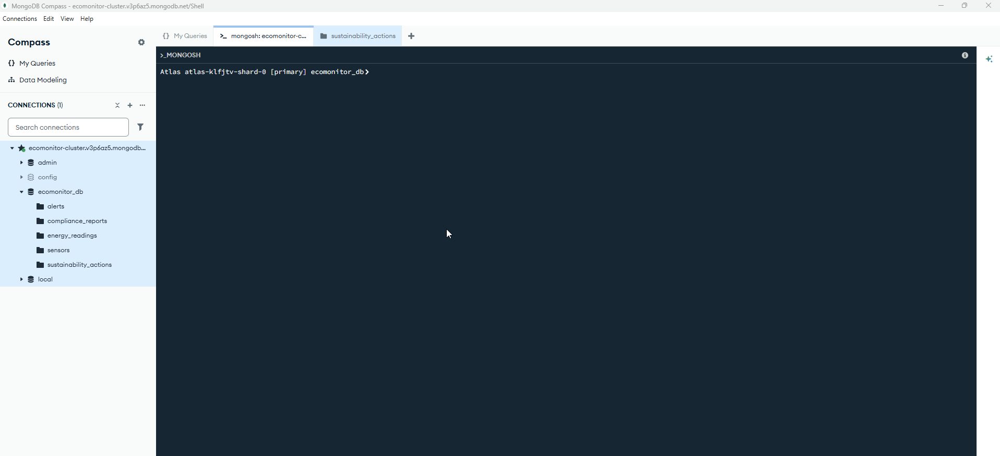

#### 📌 1.2.5 - Análise de Sustentabilidade

**Consulta 11: Total de economia por tipo de ação**
```bash
db.sustainability_actions.aggregate([
  { 
    $group: {
      _id: "$action_type",
      total_savings: { $sum: "$estimated_annual_savings_brl" }
    } 
  },
  { $sort: { total_savings: -1 } }
])
```

**Consulta 12: Agrupar ações por status e contar**
```bash
db.sustainability_actions.aggregate([
  { 
    $match: { status: { $in: ["completed", "active"] } } 
  },
  { 
    $group: {
      _id: "$status",
      count: { $sum: 1 }
    } 
  }
])
```

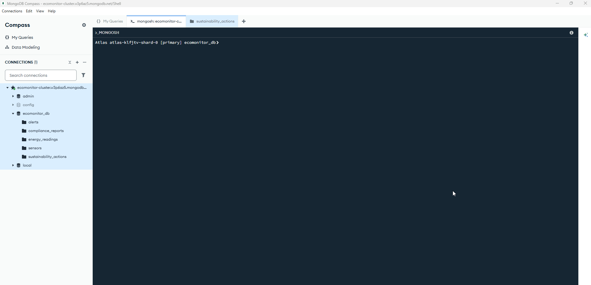

---

## Operações de Atualização

### UPDATE - Modificação de Dados

#### 📌 1.2.6 - Atualizando Sensores

**Atualizar um sensor específico:**
```bash
db.sensors.updateOne(
  { sensor_id: "MOTION_001" },
  { 
    $set: {
      status: "active",
      last_maintenance: ISODate("2026-11-20")
    } 
  }
)
```

**Atualizar múltiplos sensores inativos:**
```bash
db.sensors.updateMany(
  { status: "inactive" },
  { 
    $set: {
      status: "archived",
      archived_date: ISODate("2026-11-20")
    } 
  }
)
```

#### 📌 1.2.7 - Atualizando Relatórios de Compliance

**Atualizar um relatório específico:**
```bash
db.compliance_reports.updateOne(
  { report_id: "REP_005" },
  { 
    $set: {
      status: "verified",
      verified_by: "Auditor Certificado",
      verification_date: ISODate("2026-12-01"),
      notes: "Todos os requisitos atendidos com excelência"
    } 
  }
)
```

**Atualizar múltiplos relatórios de conformidade:**
```bash
db.compliance_reports.updateMany(
  { 
    report_type: { $in: ["ISO_50001", "ISO_14001"] },
    auditor: { $exists: true }
  },
  { 
    $set: {
      compliance_verified: true,
      final_audit_date: ISODate("2026-12-20")
    } 
  }
)
```

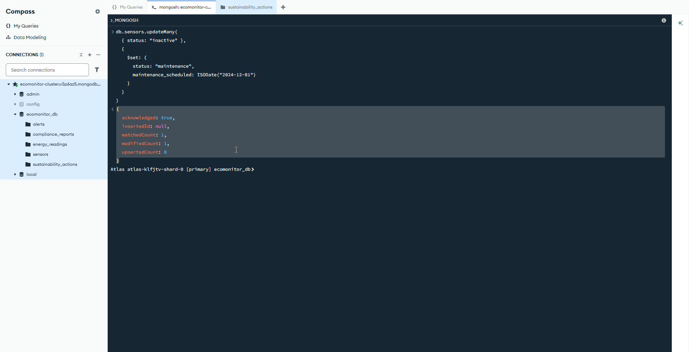

---

## Operações de Exclusão

### DELETE - Remoção de Dados

#### 📌 1.2.8 - Deletando Sensores

**Encontrar e deletar um sensor específico:**
```bash
# Primeiro, verificar o documento existente
db.sensors.find({ sensor_id: "ENERGY_001" })

# Depois, efetuar a exclusão
db.sensors.deleteOne({ sensor_id: "ENERGY_001" })
```

**Verificar quantos sensores estão em manutenção:**
```bash
db.sensors.countDocuments({ 
  status: "maintenance"
})
```

**Deletar todos os sensores em manutenção:**
```bash
db.sensors.deleteMany({ 
  status: "maintenance"
})
```


---

## Scripts Disponíveis

Este projeto inclui **5 scripts JavaScript** prontos para execução no MongoDB Shell. Eles demonstram todas as operações CRUD de forma modular e sequencial.

### 📋 Scripts do Projeto

| # | Script | Descrição | Linhas | Ação |
|---|--------|-----------|--------|------|
| 1 | `ecomonitor_setup.js` | Cria banco de dados e 5 collections | 79 | SETUP |
| 2 | `ecomonitor_create.js` | Insere 60 documentos em lote | 915 | CREATE |
| 3 | `ecomonitor_read.js` | Executa 24 consultas e agregações | 310 | READ |
| 4 | `ecomonitor_update.js` | Realiza 10 atualizações com operadores | ~500 | UPDATE |
| 5 | `ecomonitor_delete.js` | Executa 6 operações de exclusão | 317 | DELETE |

### 🚀 Como Executar

#### Opção 1: Via MongoDB Shell (Recomendado)

```powershell
# Abrir MongoDB Shell
mongosh

# Executar os scripts em sequência
source "ecomonitor_setup.js"
source "ecomonitor_create.js"
source "ecomonitor_read.js"
source "ecomonitor_update.js"
source "ecomonitor_delete.js"
```

#### Opção 2: Diretamente pela Linha de Comando

```powershell
mongosh ecomonitor_setup.js
mongosh ecomonitor_create.js
mongosh ecomonitor_read.js
mongosh ecomonitor_update.js
mongosh ecomonitor_delete.js
```

#### Opção 3: Copiar e Colar no MongoDB Shell

1. Abrir `mongosh`
2. Copiar o conteúdo de cada arquivo `.js`
3. Colar no shell e pressionar Enter

### 📊 Resumo das Operações

**SETUP** (`ecomonitor_setup.js`)
- ✅ Cria banco: `ecomonitor_db`
- ✅ Cria 5 collections: sensors, energy_readings, alerts, sustainability_actions, compliance_reports

**CREATE** (`ecomonitor_create.js`)
- ✅ Insere 12 sensores IoT
- ✅ Insere 15 leituras de energia
- ✅ Insere 12 alertas
- ✅ Insere 11 ações de sustentabilidade
- ✅ Insere 10 relatórios de compliance
- **Total: 60 documentos**

**READ** (`ecomonitor_read.js`)
- ✅ 24 consultas diferentes
- ✅ Filtros simples e avançados
- ✅ Agregações com `$group`, `$sort`, `$match`
- ✅ Projeções e análises complexas

**UPDATE** (`ecomonitor_update.js`)
- ✅ 10 operações de atualização
- ✅ Operadores: `$set`, `$inc`, `$push`, `$unset`
- ✅ Atualização de subdocumentos
- ✅ Modificação de arrays

**DELETE** (`ecomonitor_delete.js`)
- ✅ 6 operações de exclusão
- ✅ `deleteOne()` para documento único
- ✅ `deleteMany()` para múltiplos documentos
- ✅ Filtros com operadores complexos
- ⚠️ **AVISO**: Este script deleta dados. Use apenas em teste.

### ⚡ Pré-requisitos

- ✅ MongoDB instalado e rodando
- ✅ MongoDB Shell (mongosh) instalado
- ✅ Conexão ativa com MongoDB local ou remoto

### 📝 Notas Importantes

1. **Sequência Obrigatória**: Execute os scripts na ordem: Setup -> Create -> Read -> Update -> Delete
2. **Banco de Dados**: Todos os scripts usam `ecomonitor_db`
3. **Ambiente**: Recomenda-se usar apenas em ambiente de **desenvolvimento/teste**
4. **Dados**: Os 60 documentos são **fictícios** para fins educacionais
5. **Performance**: Os scripts incluem `console.log()` para rastreamento de progresso

---

## Conclusão

O **EcoMonitor** representa uma solução completa de gestão energética sustentável, leveraging o poder do MongoDB para:

✅ **Escalabilidade**: Crescer de 10 para 10.000 sensores sem reengenharia  
✅ **Fle flexibilidade**: Acomodar diferentes tipos de dados IoT naturalmente  
✅ **Performance**: Processar milhares de leituras por minuto em tempo real  
✅ **Conformidade**: Rastrear e reportar compliance ESG automaticamente  

### Impacto Mensurável (Fictício)
- 💰 **R$ 63.456** economizados em custos energéticos (Novembro 2026)
- 🌍 **18.500 kg CO₂e** evitados via eficiência e energias renováveis
- 👥 **150+ colaboradores** engajados em programas de sustentabilidade
- 📊 **100% de compliance** com normas ISO 50001 e ISO 14001

